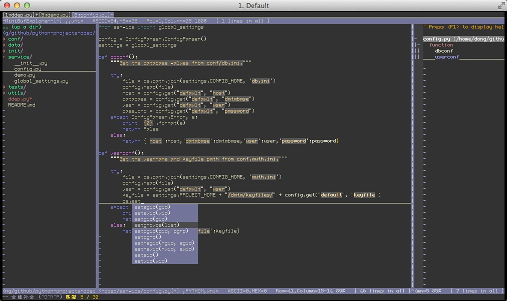

### Tips

```bash
# For users who just want a vimrc without any plugin, use "vimrc_tiny.vim" instead:
wget https://raw.githubusercontent.com/mcsrainbow/vimrc/master/vimrc_tiny.vim -o ~/.vimrc

# For "solarized" and "base16" color schemes, check out their source repositories for advanced usage:
https://github.com/altercation/vim-colors-solarized
https://github.com/chriskempson/base16-vim
```

## Instruction

### 1. Install packages

#### on Ubuntu:

```
sudo apt install vim git ctags pyflakes
```

#### On CentOS:

```
sudo yum install vim git ctags pyflakes
sudo yum upgrade vim-common vim-minimal
```

#### On macOS:

```
brew install vim
brew install git ctags
pip install pyflakes
```

### 2. Install Vundle package

```
git clone https://github.com/VundleVim/Vundle.vim.git ~/.vim/bundle/Vundle.vim
```

### 3. Copy the configuration file

```
git clone https://github.com/mcsrainbow/vimrc
cd vimrc
cp vimrc ~/.vimrc
```

### 4. Install Plugins

```
vim +PluginInstall +qall
```

### 5. Comment out Plugins in .vimrc then Remove Plugins

```
vim +PluginClean +qall
```

### 6. Turn on/off paste-mode by `F6` to paste code without auto-indent and auto-complete

## Screenshot


